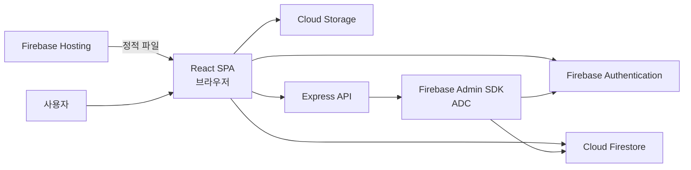

# LifeSculpture

> 배운 것과 살아온 순간을 `Study`와 `Blog`로 나누어 기록하는 개인 지식·콘텐츠 아카이브입니다.

[웹사이트 바로가기](https://lifesculpture-220b3.web.app)

LifeSculpture는 React와 Firebase로 만든 풀스택 웹 애플리케이션입니다. 방문자는 공개 글을 탐색하고, Google 계정으로 로그인한 사용자는 게시글에 공감할 수 있습니다. 관리자는 리치 텍스트 편집기와 이미지 업로드, 공개 범위 설정, 카테고리 이동으로 콘텐츠를 운영합니다.

## 프로젝트 한눈에 보기

| 사용자 | 할 수 있는 일 |
| --- | --- |
| 방문자 | 공개된 Study·Blog 글 탐색, 필터링, 정렬, 상세 글 읽기, 테마 변경 |
| 로그인 사용자 | 게시글 공감 |
| 관리자 | 글 작성·수정·삭제, 이미지 업로드, 공개/비공개 전환, 카테고리 이동 및 필터 구성 |

## 주요 화면

| 경로 | 설명 |
| --- | --- |
| `/` | 웹·앱 개발, AI, 여행, 팁 콘텐츠로 이동하는 홈 |
| `/study` | 개발·IT, 과학, 수학, 인문·사회, 프로젝트 학습 기록 |
| `/blog` | 일상, 여행, 사진, 팁, 리뷰, 개발 블로그 |
| `/posts/:category/:id` | 본문, 이미지와 공감을 제공하는 글 상세 화면 |
| `/write` | 관리자 전용 글 작성 화면 |
| `/edit-post/:category/:id` | 관리자 전용 글 편집 화면 |
| `/admin` | 관리자 전용 정적 안내 카드 화면 |

## 핵심 기능

### 콘텐츠 탐색

- Study와 Blog로 분리된 콘텐츠 컬렉션
- 상위 주제와 태그를 이용한 필터링
- 정렬, 페이지네이션, 조회수와 공감 수 표시
- 공개 글만 노출하는 권한 기반 목록·상세 조회
- 반응형 레이아웃과 라이트/다크 테마

### 로그인 사용자 참여

- Firebase Authentication 기반 Google 로그인
- 게시글 공감

### 관리자 콘텐츠 운영

- Quill 기반 리치 텍스트 편집
- 이미지 업로드와 Firebase Storage 수명주기 관리
- 코드, 표, 수식(KaTeX) 등 구조화된 본문 표현
- 공개/비공개 전환과 이미지 접근 권한 연동
- Study와 Blog 간 글·공감 데이터의 잠금 기반 원자적 이동과 실패 복구 원장
- Study·Blog 상위 필터와 태그 구성

## 아키텍처



일반적인 콘텐츠 읽기·공감은 브라우저가 Firebase에 직접 요청하고 `firestore.rules`와 `storage.rules`가 권한을 강제합니다. 카테고리 이동은 원본을 먼저 비공개 잠근 뒤 단일 Firestore 트랜잭션으로 확정하며, Express API가 설정된 환경에서도 같은 잠금·트랜잭션 절차를 사용합니다. 서버 응답을 확인할 수 없을 때는 위험한 클라이언트 재실행으로 전환하지 않고 작업 원장과 서버 상태를 기준으로 복구합니다.

## 기술 스택

| 영역 | 기술 |
| --- | --- |
| 프런트엔드 | React 19, React Router 7, Bootstrap 5, Chart.js, Quill, KaTeX |
| 인증 | Firebase Authentication, Google OAuth |
| 데이터 | Cloud Firestore |
| 파일 | Firebase Storage |
| 백엔드 | Node.js, Express 5, Firebase Admin SDK |
| 배포 | Firebase Hosting |
| 테스트 | Jest, React Testing Library, Node Test Runner, Firebase Emulator Suite |

## 저장소 구조

```text
LifeSculpture/
├── frontend/
│   ├── src/
│   │   ├── components/    # 레이아웃, 인증, 글, 편집기 UI
│   │   ├── pages/         # 홈, 목록, 상세, 관리자 화면
│   │   ├── services/      # Firestore·Storage 데이터 작업
│   │   ├── hooks/         # 인증, 목록, 콘텐츠 표현 상태
│   │   ├── firebase/      # Firebase Web SDK 초기화
│   │   └── style/         # 공통·화면·컴포넌트 스타일
│   └── scripts/           # 빌드 환경변수 검증
├── server/                # Express API와 Firebase Admin 연동
├── tests/
│   ├── rules/             # Firestore·Storage 보안 규칙 테스트
│   └── hosting/           # Hosting 캐시 헤더 테스트
├── firestore.rules        # Firestore 접근 제어
├── firestore.indexes.json # Firestore 복합 인덱스
├── storage.rules          # Storage 접근 제어
└── firebase.json          # Emulator·Hosting·배포 설정
```

## 로컬에서 실행하기

### 준비물

- Node.js 22 이상
- npm
- Firebase 프로젝트
- Google Cloud CLI (`gcloud`) — 로컬 Express 서버에서 ADC를 사용할 때 필요
- Java 17 이상 — Firebase Emulator Suite 테스트를 실행할 때 필요

### 1. 저장소와 의존성 준비

```bash
git clone https://github.com/dev-samuel-codes/LifeSculpture.git
cd LifeSculpture

npm install
npm install --prefix frontend
npm install --prefix server
```

### 2. Firebase 프로젝트 준비

자신의 Firebase 프로젝트에서 다음 기능을 활성화합니다.

1. Authentication의 Google 로그인 공급자
2. Cloud Firestore
3. Cloud Storage
4. Firebase Hosting
5. 웹 앱 등록

이 저장소의 `.firebaserc`는 운영 프로젝트를 가리킵니다. 포크나 로컬 복제본에서는 반드시 본인의 Firebase 프로젝트로 전환한 뒤 배포하세요.

```bash
npx firebase login
npx firebase use --add
```

### 3. 환경변수 설정

예제 파일을 복사합니다.

```bash
cp frontend/.env.example frontend/.env
cp server/.env.example server/.env
```

`frontend/.env`에는 Firebase Console의 웹 앱 구성과 Google OAuth 클라이언트 ID를 입력합니다.

| 변수 | 용도 |
| --- | --- |
| `REACT_APP_GOOGLE_CLIENT_ID` | Google OAuth 웹 클라이언트 ID |
| `REACT_APP_FIREBASE_API_KEY` | Firebase 웹 API 키 |
| `REACT_APP_FIREBASE_AUTH_DOMAIN` | Firebase Auth 도메인 |
| `REACT_APP_FIREBASE_PROJECT_ID` | Firebase 프로젝트 ID |
| `REACT_APP_FIREBASE_STORAGE_BUCKET` | Storage 버킷 |
| `REACT_APP_FIREBASE_MESSAGING_SENDER_ID` | Firebase 메시징 발신자 ID |
| `REACT_APP_FIREBASE_APP_ID` | Firebase 웹 앱 ID |
| `REACT_APP_FIREBASE_MEASUREMENT_ID` | Analytics 측정 ID |
| `REACT_APP_BACKEND_URL` | Express API 주소. 로컬 기본값은 `http://localhost:5000` |

`server/.env`에는 서버 전용 값을 입력합니다.

| 변수 | 용도 |
| --- | --- |
| `JWT_SECRET_KEY` | 서버가 발급하는 애플리케이션 JWT 서명 키 |
| `GOOGLE_CLIENT_ID_BACKEND` | 서버에서 검증할 Google OAuth 클라이언트 ID |
| `CORS_ORIGIN` | 허용할 프런트엔드 Origin. 로컬 기본값은 `http://localhost:3000` |
| `PORT` | Express 포트. 기본값은 `5000` |
| `GOOGLE_CLOUD_PROJECT` | Firebase Admin SDK가 사용할 Google Cloud 프로젝트 ID |

`.env` 파일은 Git에서 제외됩니다. Firebase 웹 구성값은 브라우저에 노출되는 식별자이지만, Google Cloud Console에서 API 제한과 허용 도메인을 설정해야 합니다.

### 4. Application Default Credentials 설정

백엔드는 서비스 계정 JSON 키 파일을 읽지 않고 Application Default Credentials(ADC)를 사용합니다.

```bash
gcloud auth application-default login
export GOOGLE_CLOUD_PROJECT="your-project-id"
```

서비스 계정 개인 키 파일을 만들거나 저장소에 추가하지 마세요. 배포 환경에서는 런타임 서비스 계정에 필요한 최소 권한만 부여합니다.

### 5. 개발 서버 시작

```bash
npm start
```

- 프런트엔드: <http://localhost:3000>
- Express API: <http://localhost:5000>

프런트엔드만 실행하려면 `npm start --prefix frontend`, 백엔드만 실행하려면 `npm run start-backend`를 사용합니다.

## 최초 관리자 설정

관리자 화면은 Firestore의 `users/{uid}.role` 값이 `admin`인 사용자에게만 열립니다.

1. 애플리케이션에서 Google 로그인을 한 번 완료합니다.
2. Firebase Authentication에서 사용자의 UID를 확인합니다.
3. Firebase Console에서 `users/{uid}` 문서를 만들고 `role: "admin"`을 설정합니다.
4. 다시 로그인해 `/write`와 `/admin` 경로가 표시되는지 확인합니다.

클라이언트는 자신의 역할을 관리자 값으로 변경할 수 없습니다. 최초 관리자 지정은 Firebase Console처럼 신뢰할 수 있는 관리 경로에서만 수행하세요.

## 데이터 구조

| 경로 | 역할 |
| --- | --- |
| `study/{postId}` | Study 글 본문과 공개 상태 |
| `blog/{postId}` | Blog 글 본문과 공개 상태 |
| `{category}/{postId}/likes/{uid}` | 게시글 공감 멤버십 |
| `post_index/{category}/posts/{postId}` | 공개 목록 조회용 요약 인덱스 |
| `post_deletion_jobs/{jobId}` | 삭제 후 Storage 정리를 재시도하기 위한 관리자 전용 작업 원장 |
| `post_move_jobs/{jobId}` | 이동 잠금, 응답 유실 판정, 준비 이미지 정리를 위한 관리자 전용 작업 원장 |
| `users/{uid}` | 사용자 정보와 역할 |
| Storage `post-images/{category}/{postId}/{fileName}` | 게시글 이미지 |

## 테스트와 검증

```bash
# Firestore·Storage Rules, 서버, 빌드 환경변수 테스트
npm test

# 프런트엔드 테스트
CI=true npm test --prefix frontend -- --runInBand

# 프로덕션 빌드
npm run build

# 빌드 결과물의 Hosting 캐시 정책 테스트
npm run test:hosting
```

`npm test`는 Firebase Emulator Suite를 자동으로 실행합니다. 테스트는 실제 Firebase 프로젝트 대신 `demo-lifesculpture` 프로젝트 ID를 사용합니다.

## 배포

### 프런트엔드와 Firebase 규칙

배포 전에 선택된 Firebase 프로젝트와 `frontend/.env`의 값을 다시 확인합니다.

```bash
npm run build
npx firebase deploy --only hosting,firestore:rules,firestore:indexes,storage
```

### Express API

Express 서버는 Firebase Hosting과 별도로 배포합니다. 배포 환경에서 다음을 지켜야 합니다.

- 런타임 서비스 계정으로 ADC 제공
- 서버 환경변수를 Secret Manager 등 안전한 저장소에서 주입
- `CORS_ORIGIN`을 실제 프런트엔드 도메인으로 제한
- `REACT_APP_BACKEND_URL`을 배포된 API 주소로 설정한 뒤 프런트엔드 재빌드

## 보안

- Firestore와 Storage 접근은 클라이언트 UI가 아니라 Security Rules가 강제합니다.
- 관리자 API는 Firebase ID 토큰을 검증하고 Firestore 역할을 다시 확인합니다.
- 비공개 글의 이미지도 공개 글과 동일하게 노출되지 않도록 Storage Rules와 수명주기를 함께 관리합니다.
- 서비스 계정 JSON, `.env`, JWT 비밀키를 커밋하지 않습니다.

## 기여하기

1. 저장소를 포크하고 작업 브랜치를 만듭니다.
2. 변경 범위에 맞는 테스트를 추가하거나 실행합니다.
3. `npm test`, 프런트엔드 테스트, `npm run build`가 통과하는지 확인합니다.
4. 변경 이유와 검증 결과를 포함해 Pull Request를 엽니다.

버그 제보에는 재현 경로, 기대 동작, 실제 동작과 실행 환경을 포함해 주세요.
